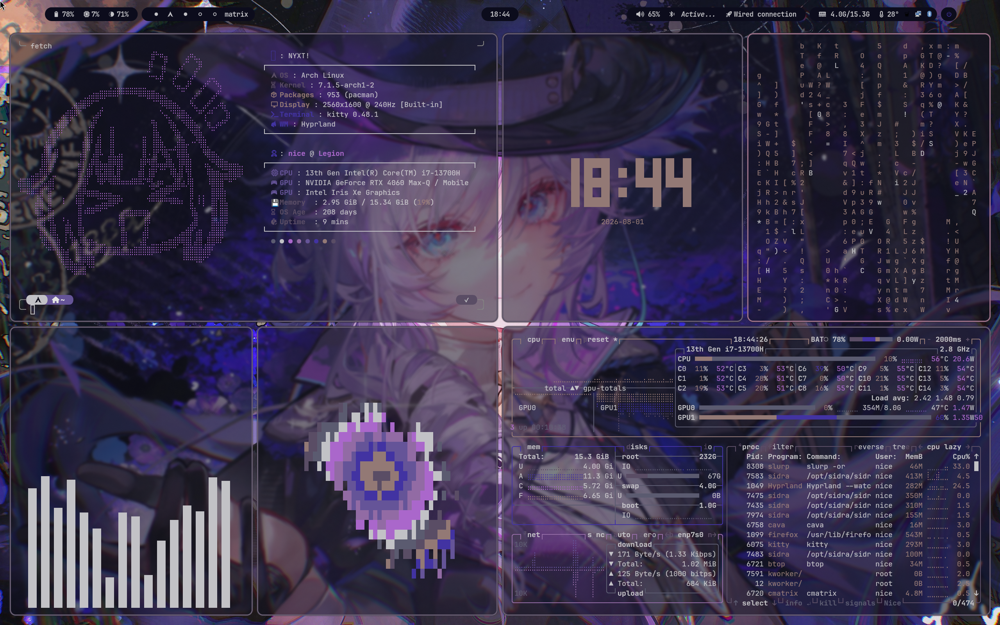
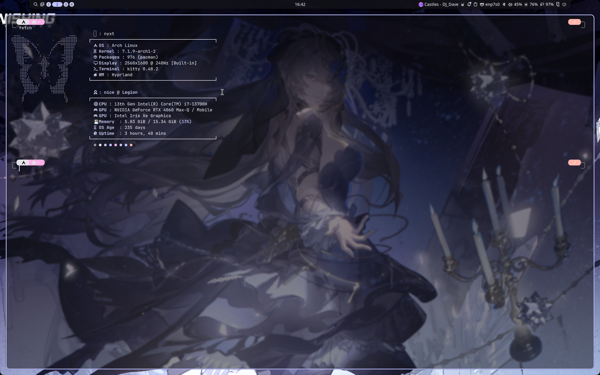
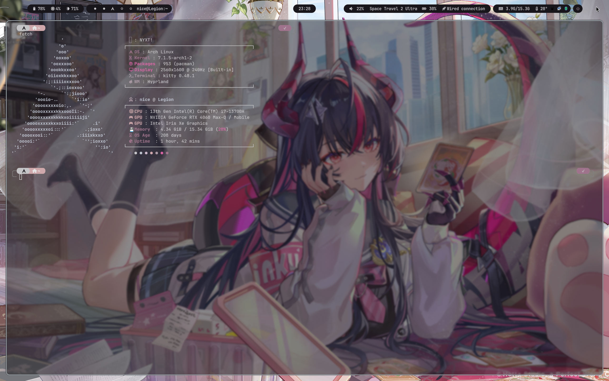

# NYXT-HYPRLAND

Current dotfile with noctalia
<br> 
**For more seperate config modules with less ram usage please check**
[legacy](https://github.com/NYXTSYSTEM/NYXTHYPRLAND/tree/legacy)
</br>


## Dependencies

- **Window Manager**: [hyprland](https://github.com/hyprwm/Hyprland)
- **Compositor**: wayland
- **Terminal Emu**: [kitty](https://sw.kovidgoyal.net/kitty/)
- **Shell**: [noctlia](https://github.com/noctalia-dev/noctalia)
- **Display Manager**: [greetd](https://github.com/kennylevinsen/greetd)
- **noctalia-greetd**: [noctalia-greetd](https://docs.noctalia.dev/greeter/)

## Screenshots





## Installation

1. Clone this repository:
    ```bash
    git clone https://github.com/NYXTSYSTEM/NYXTHYPRLAND.git
    cd NYXTHYPRLAND
    ```   
2. **Install the required dependencies:** for my dots i use **Arch based** distro
    <br>
    **FOR OTHERS DISTRO PLEASE PROCESS WITH EACH DEPENDENCIES DOCS, WIKIS**
    </br>
    ```bash
    sudo pacman -Syu
    sudo pacman -S hyprland kitty zsh ttf-jetbrains-mono ttf-jetbrains-mono-nerd fastfetch noctalia
    ```
    **or** uses AUR helper **It's recommended to use **pacman** instead of an AUR helper because it's faster and more secure. Only use AUR helper when a package isn't in the official Arch repos.**
    ```
    yay -Syu --noconfirm
    yay -S hyprland kitty zsh ttf-jetbrains-mono ttf-jetbrains-mono-nerd fastfetch noctalia
    ```

    **for [noctalia-greetd](https://docs.noctalia.dev/greeter/) please process with the installation pages** or you can ignore it
3. Copy the config files to their respective locations:
    ```
    cp -r .config/* ~/.config/
    ```

4. **Reboot** and then you're good to go enjoy your new setup!

## Customization

Feel free to config my rice `~/.config` directory to suits yourself however you like!

---


<div align="center"><p>

    
</p>
</div>

---